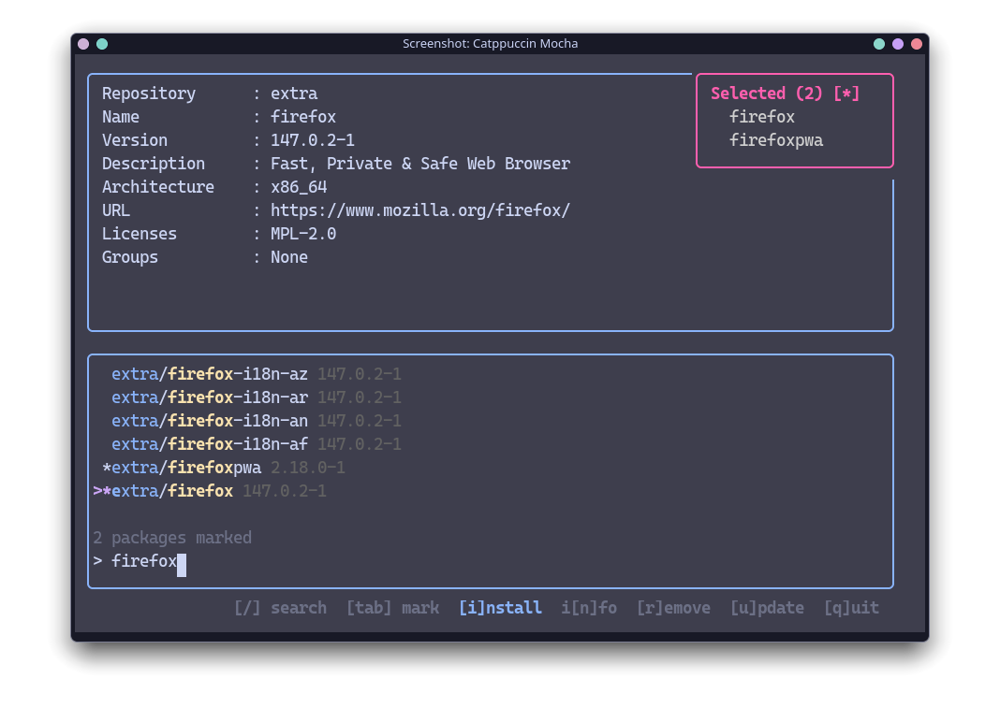

<div align="center">


# gaur

**Arch Linux package management that never leaves the terminal.**

Search, inspect, install, update, remove and clean your system from one keyboard-driven
interface — a TUI wrapped around `pacman`, your AUR helper, and `fzf`.

[](https://github.com/prbhtkumr/gaur/actions/workflows/go-security.yml)
[](LICENSE)
[](go.mod)
[](https://aur.archlinux.org/packages/gaur-bin/)

**[Documentation](https://gaur.prbhtkumr.xyz)** ·
**[Themes](https://gaur.prbhtkumr.xyz/themes)** ·
**[Install](#quick-start)** ·
**[Report an issue](https://github.com/prbhtkumr/gaur/issues)**

> ⚠️ **Disclaimer:** This project is mostly vibecoded and continues to be developed through vibecoding.
> Do report rough edges, and expect an occasional "it works on my machine" moment (trying my best to eliminate those).

</div>

---

## Preview

<p align="center">
  
</p>

<p align="center"><em>Catppuccin Mocha, one of eleven built-in themes. See the rest at <a href="https://gaur.prbhtkumr.xyz/themes">gaur.prbhtkumr.xyz/themes</a>.</em></p>

---

## Features

**Search & install**
- Fuzzy ranking powered by `fzf`, with match highlighting
- Repo-scoped queries — `c:`, `e:`, `m:`, `a:` — and they combine: `ae:firefox`
- Mark anything with `Tab`, ship it all in one command
- A live details pane: repository, version, license, upstream URL

**Maintenance**
- Dashboard with package counts, disk usage bars and repository distribution
- Full system update, or a hand-picked subset via selective update
- Cache cleaner with keep policies, plus per-package selective cleaning
- Orphan detection and one-key removal

**Interface**
- Eleven themes built in, custom TOML themes, live preview while you scroll
- Mode-specific coloring, centered dialogs, full mouse wheel support
- Settings menu (`,`) — swap theme, AUR helper and border without restarting

> **Security:** every command is built as an argument array, never a shell string. Package
> names are checked against a strict allowlist, config values are clamped instead of
> trusted, and CI runs dedicated command-injection, privilege-escalation and TUI-spoofing
> tests alongside gosec, CodeQL and govulncheck.

---

## Requirements

- Arch Linux or an Arch-based distribution
- An AUR helper — [paru](https://github.com/Morganamilo/paru) or [yay](https://github.com/Jguer/yay)
- [fzf](https://github.com/junegunn/fzf) for fuzzy ranking
- [paccache](https://man.archlinux.org/man/paccache.8) from `pacman-contrib`
- Go **1.24+** — only if you build from source

---

## Quick start

```bash
paru -S gaur-bin     # or: yay -S gaur-bin
gaur
```

From source:

```bash
git clone https://github.com/prbhtkumr/gaur.git
cd gaur
go build -o gaur .
sudo install -Dm755 gaur /usr/local/bin/gaur
```

Or straight into your `GOBIN`:

```bash
go install github.com/prbhtkumr/gaur@latest
```

Once it is running:

```bash
gaur                # default mode
gaur -d             # open on the dashboard
gaur -i             # open on install
gaur --theme dracula
```

---

## Controls

| Key | Action |
|-----|--------|
| `i` · `d` · `r` · `u` | Switch mode: **install**, **dashboard**, **remove**, **update** (`Alt+2` · `Alt+1` · `Alt+4` · `Alt+3`) |
| `/` | Focus the search box |
| `↑` `↓` · `j` `k` | Move one item · `PgUp` `PgDn` jump ten |
| `Tab` | Mark or unmark the selected package |
| `Enter` | Run the operation on the marked set |
| `*` | Focus the selection panel |
| `Esc` | Leave the search box · clear marks |
| `s` | Selective update (update mode) |
| `m` | Mirror list editor (update mode) |
| `,` | Settings |
| `q` · `Ctrl+C` | Quit |

**On the dashboard:** `t` `e` `f` `o` jump straight into remove mode filtered to all /
explicit / foreign / orphaned · `c` opens the cache menu · `R` removes every orphan ·
`Ctrl+R` reloads the stats.

**In dialogs:** `Enter` or `y` confirms, `Esc` or `n` cancels, `↑` `↓` scrolls the list.

**Mouse:** the wheel scrolls lists, split panes and dialogs — left pane scrolls the list,
right pane scrolls the details.

---

## Search filters

| Mode | Prefix | Matches |
|------|--------|---------|
| install | `c:` | core repository |
| install | `e:` | extra repository |
| install | `m:` | multilib repository |
| install | `a:` | AUR only |
| remove | `t:` | all installed packages |
| remove | `e:` / `l:` | explicitly installed |
| remove | `f:` / `a:` | foreign (AUR) packages |
| remove | `o:` | orphaned |

Prefixes combine: `ae:firefox` searches AUR and Extra, `of:google` finds orphaned AUR
packages matching "google".

---

## Configuration

gaur writes `~/.config/gaur/config.toml` on first run. Most of it can also be edited live
from the settings menu (`,`).

```toml
[startup]
default_mode = "install"        # dashboard | install | remove | update

[ui]
theme = "catppuccin-mocha"      # gaur --list-themes
border_type = "rounded"         # rounded | normal | thick | double

[commands]
aur_helper = "paru"             # paru | yay
install_flags = ""              # extra flags for installs
remove_flags = "-Rns"
cache_tool = "paccache"

[advanced]
debounce_ms = 150               # package details delay
cache_dir = ""                  # absolute path, empty = default
```

Full reference in the **[configuration docs](https://gaur.prbhtkumr.xyz/docs/configuration)**.

---

## Themes

Eleven themes ship baked into the binary: **Catppuccin Mocha / Frappe / Macchiato**,
**Dracula**, **Gruvbox Dark**, **Monokai Pro**, **One Dark**, **Rose Pine**,
**Solarized Dark**, and **Tokyonight Night / Storm**.

```bash
gaur --list-themes          # print them all
gaur --theme dracula        # use one
gaur --export-themes        # copy defaults out so you can edit them
```

Press `,` in the app to cycle themes with a live preview.

<details>
<summary><b>Write your own theme</b></summary>

Themes are plain TOML files in `$XDG_CONFIG_HOME/gaur/themes/`
(typically `~/.config/gaur/themes/`).

```bash
gaur --export-themes                       # start from the defaults
$EDITOR ~/.config/gaur/themes/my_theme.toml # edit
gaur --theme my-theme                      # or pick it from settings
```

```toml
# base
border = "#6c7086"
selected = "#cba6f7"
text = "#cdd6f4"
subtle = "#6c7086"
title = "#f9e2af"

# ui elements
scrollbar_track = "#181825"
scrollbar_thumb = "#6c7086"
selection_bg = "#313244"
dim_text = "#6c7086"

# mode colors
install = "#89b4fa"
dashboard = "#f5c2e7"
remove = "#f38ba8"
update = "#a6e3a1"
cache = "#cba6f7"

# source colors
core = "#a6e3a1"
extra = "#89b4fa"
multilib = "#fab387"
aur = "#cba6f7"

# status colors
success = "#a6e3a1"
warning = "#f9e2af"
error = "#f38ba8"
highlight = "#f9e2af"

# dashboard colors
dashboard_label = "#cdd6f4"
dashboard_value = "#89dceb"
dashboard_warning = "#f38ba8"
dashboard_desc = "#a6adc8"

# dialog colors
dialog_border = "#cba6f7"
confirm_install = "#89b4fa"
confirm_remove = "#fab387"
confirm_clean = "#a6e3a1"
confirm_nuke = "#f38ba8"
confirm_selective = "#cba6f7"
```

Filenames become display names: `my_theme.toml` shows up as **My Theme** — underscores and
hyphens turn into spaces and title-case.

</details>

---

## How it works

1. **Local first** — repository packages are read once with `pacman -Sl` and held in
   memory. Typing never shells out to pacman.
2. **Ranked by fzf** — each keystroke pipes the combined repo + AUR list through
   `fzf --filter` and maps the indices back.
3. **AUR queries are gated, not debounced** — two characters minimum, no repeat of the
   same query, one request in flight, stale responses dropped.
4. **Hands off the terminal** — installs, removals and updates run through
   `tea.ExecProcess`, so sudo prompts, conflict resolution and license prompts behave
   exactly as they do outside gaur.
5. **Refreshes itself** — after any change the dashboard, both package lists and the
   update count are rebuilt from the system rather than patched up.

The long version lives in the **[internals docs](https://gaur.prbhtkumr.xyz/docs/internals)**.

---

## License

GPL-3.0 — see [LICENSE](LICENSE).

---

<div align="center">

**[Documentation](https://gaur.prbhtkumr.xyz)** ·
**[Report a bug](https://github.com/prbhtkumr/gaur/issues)** ·
**[Request a feature](https://github.com/prbhtkumr/gaur/issues)**

</div>
